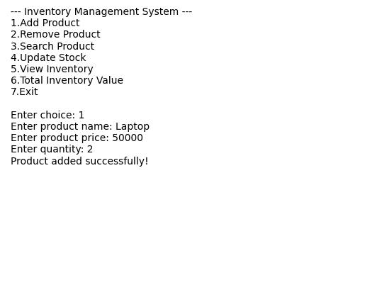

# Inventory Management System

A lightweight, console-based Inventory Management System built in Python. It allows you to add, remove, search, and update products, view the current inventory, and calculate total stock value — all from a simple command-line menu.



## Features

- **Add Product** — Register a new product with name, price, and quantity
- **Remove Product** — Delete a product from inventory by name
- **Search Product** — Look up a product's details by name
- **Update Stock** — Modify the quantity of an existing product
- **View Inventory** — Display all products currently in stock
- **Total Inventory Value** — Calculate the combined value of all stock (price × quantity)

## Demo

```
--- Inventory Management System ---
1.Add Product
2.Remove Product
3.Search Product
4.Update Stock
5.View Inventory
6.Total Inventory Value
7.Exit

Enter choice: 1
Enter product name: Laptop
Enter product price: 50000
Enter quantity: 2
Product added successfully!
```

## Getting Started

### Prerequisites

- Python 3.8 or higher

### Installation

1. Clone the repository
   ```bash
   git clone https://github.com/<your-username>/INVENTORY-MANAGEMENT-SYSTEM.git
   cd INVENTORY-MANAGEMENT-SYSTEM
   ```

2. (Optional) Create a virtual environment
   ```bash
   python -m venv venv
   source venv/bin/activate   # On Windows: venv\Scripts\activate
   ```

3. No external dependencies are required — this project uses only the Python standard library.

### Running the Application

```bash
python inventory.py
```

Follow the on-screen menu to manage your inventory.

## Project Structure

```
INVENTORY-MANAGEMENT-SYSTEM/
├── inventory.py          # Main application logic and CLI menu
├── output_example.png    # Sample console output
├── requirements.txt      # Project dependencies (none required)
├── LICENSE                # Project license
└── README.md              # Project documentation
```

## How It Works

The system stores inventory in memory using a Python dictionary, where each product name maps to its price and quantity:

```python
inventory = {
    "Laptop": {"price": 50000, "qty": 2}
}
```

> **Note:** Data is **not persisted** between sessions. All inventory entries are lost when the program exits. See [Roadmap](#roadmap) below for planned improvements.

## Roadmap

Potential enhancements for future versions:

- [ ] Persist inventory to a file (CSV/JSON) or a database (SQLite)
- [ ] Input validation (e.g., negative prices/quantities, duplicate product names)
- [ ] Low-stock alerts and reporting
- [ ] Export inventory reports to CSV/Excel
- [ ] Unit tests for core functions
- [ ] Optional GUI or web interface

## Contributing

Contributions are welcome. Please open an issue to discuss proposed changes, or submit a pull request following the guidelines in [CONTRIBUTING.md](CONTRIBUTING.md).

## License

This project is licensed under the MIT License — see the [LICENSE](LICENSE) file for details.

## Author

Maintained by [Ayaan Pasha] (https://github.com/<ayaanpasha007>).
